## Desafio Itaú 🚀
Serviço de tranferência entre contas em REST inspirado nos conceitos da [Arquitetura Limpa](https://www.amazon.com.br/Arquitetura-Limpa-Artes%C3%A3o-Estrutura-Software/dp/8550804606/ref=sr_1_1?__mk_pt_BR=%C3%85M%C3%85%C5%BD%C3%95%C3%91&crid=1LPQ357Q9A39S&keywords=arquitetura+limpa&qid=1706715845&sprefix=arquitetura+limpa%2Caps%2C209&sr=8-1) e [Código Limpo](https://www.amazon.com.br/C%C3%B3digo-limpo-Robert-C-Martin/dp/8576082675) de [Ungle Bob](https://pt.wikipedia.org/wiki/Robert_Cecil_Martin), 


## 👨‍💻 Tecnologias
- Java 17
- Maven 4.0.0
- Spring Boot 3.2.6
- Spring Boot Actuator
- Spring Cloud OpenFeign
- Spring Cloud AWS
- Spring Retry
- H2 Database
- Lombok
- MapStruct

## 🎡 Como Iniciar/Executar o Projeto

- [X] _Realize o `git clone` do projeto;_
- [X] _Installe **[JDK 17](https://www.oracle.com/br/java/technologies/downloads)** instalado;_  
- [X] _Crie um profile na **[AWS CLI](https://docs.aws.amazon.com/cli/latest/userguide/getting-started-install.html)** com os dados abaixo para configurar o [LocalStack](https://www.localstack.cloud/) para [SQS](https://aws.amazon.com/pt/sqs/);_
    - [X] _**AWS AccessKey** = ANUJDEKAVADIYAEXAMPLE_
    - [X] _**AWS SecretKey** = 2QvM4/Tdmf38SkcD/qalvXO4EXAMPLEKEY_
    - [X] _**AWS Region** = us-east-1_
    - [X] _**Output Format** = json_
- [X] _Na raiz do projeto, onde o arquivo docker-compose.yml está localizado, execute o comando abaixo para construir e iniciar todos o container do [Wiremock](https://wiremock.org/) e LocalStack definido no [Docker Compose](https://docs.docker.com/compose/);_

      docker-compose up --build -d
- [X] _Importe os projetos no [IntelliJ IDEA](https://www.jetbrains.com/idea):_
    - [X] _dentro do [IntelliJ IDEA](https://www.jetbrains.com/idea), vá em `File > Open`, escolha a pasta `api-transferencia` na raiz do projeto, importe como [Maven](https://maven.apache.org) e inicie o mesmo através da classe `Application.java`;_
    - [X] _dentro da [IntelliJ IDEA](https://www.jetbrains.com/idea), vá em `File > Open`, escolha a pasta `worker-bacen` na raiz do projeto, importe como [Maven](https://maven.apache.org) e inicie o mesmo através da classe `Application.java`;_

## Descrição dos Serviços

- **api-transferencia**: _serviço REST de transferência entre contas._
- [X] _[Actuator](https://spring.io/guides/gs/actuator-service)_ - `curl -X GET http://localhost:8080/actuator`
- [X] _console do H2 Database - `http://localhost:8080/h2-console`_

- **worker-bacen**: _serviço reponsável pela notificação ao Bacen respeitando o RateLimit._
- [X] _[Actuator](https://spring.io/guides/gs/actuator-service)_ - `curl -X GET http://localhost:8081/actuator`


## cURL de Requisições

- **DEVE realizar a transferência entre contas retornando HTTP Status 200 - OK e UUID Transferência**

```bash
curl --location --request POST 'http://localhost:8080/transferencia' \
--header 'Content-Type: application/json' \
--data-raw '{
    "idCliente": "bcdd1048-a501-4608-bc82-66d7b4db3600",
    "valor": 0.01,
    "conta": {
        "idOrigem": "d0d32142-74b7-4aca-9c68-838aeacef96b",
        "idDestino": "41313d7b-bd75-4c75-9dea-1f4be434007f"
    }
}'
```

- **NAO DEVE realizar a transferência entre contas, deve retornar mensagem "Conta não encontrada 'idOrigem'." e HTTP Status 404 - NotFound.**
  
```bash
curl --location --request POST 'http://localhost:8080/transferencia' \
--header 'Content-Type: application/json' \
--data-raw '{
    "idCliente": "bcdd1048-a501-4608-bc82-66d7b4db3600",
    "valor": 0.01,
    "conta": {
        "idOrigem": "inexistente",
        "idDestino": "41313d7b-bd75-4c75-9dea-1f4be434007f"
    }
}'
```

- **NAO DEVE realizar a transferência entre contas, deve retornar "Cliente não encontrado 'idCliente'." quando não localizar Cliente a partir de id e HTTP Status 404 - NotFound.**
```bash
curl --location --request POST 'http://localhost:8080/transferencia' \
--header 'Content-Type: application/json' \
--data-raw '{
    "idCliente": "idCliente",
    "valor": 0.01,
    "conta": {
        "idOrigem": "d0d32142-74b7-4aca-9c68-838aeacef96b",
        "idDestino": "41313d7b-bd75-4c75-9dea-1f4be434007f"
    }
}'
```

## Cenários Adicionais
- _Dado uma requisição de transferência informando idCliente, valor e dados da Conta (idOrigem e idDestino),
      Quando consultar Conta Origem a partir de idOrigem e não estiver ativa,
      Deve retornar HTTP Status 422 com a mensagem de erro "Conta 'idOrigem' indisponível para efetuar transferências."_

-  _Dado uma requisição de transferência informando idCliente, valor e dados da Conta (idOrigem e idDestino),
      Quando consultar Conta Origem a partir de idOrigem e a mesma não possuir saldo suficiente para efetuar a transferência,
      Deve retornar HTTP Status 422 com a mensagem de erro "Saldo insuficiente para efetuar transferência."_

- _Dado uma requisição de transferência informando idCliente, valor e dados da Conta (idOrigem e idDestino),
      Quando consultar Conta Origem a partir de idOrigem e a mesma não possuir limite diário suficiente para efetuar a transferência,
      Deve retornar HTTP Status 422 com a mensagem de erro "Limite diário indisponível para efetuar transferência."_
      
## 🏛️ Arquitetura

- **Solução técnica**

```mermaid
flowchart 
    A(Canal) --> B(API Gateway)
    B --> C(VPC Link)
    C --> D(ALB - Application Load Balancer)
    D --> E[api-transferencia]
    E --> O[(Banco de Dados 
            TRANSFERENCIA_ENTITY)]
    E --> F{{Validações Básicas}}
    subgraph Retry - Resilience4J
        G
        H
    end
    F --> G[[API de Consulta de Clientes]]
    F --> H[[API de Consulta de Contas]]
    E --> | Transferência solicitada - UUID Transferência | A
    E --> I[[sqs-bacen-notificacao]]
    I --> J[worker-bacen]
    J --> |Rate Limit| L[[API de Notificação do Bacen]]
    J --> M[[sqs-transferencia-realizada]]
    M -.-> N[[worker-notificacao-realizada]]
    N -.-> P[[Consumidor ]]
    P -.-> Q[[WebHook/Long Polling]]
    Q -.-> | Transferência finalizada - Bacen notificado | A
    A -.-> Q
```


- **Observabilidade**


- **Escalonamento - Oscilação de Carga**

```mermaid
flowchart TD
    A(Canal) --> B(API Gateway)
    B --> C(VPC Link)
    C --> D(ALB - Application Load Balancer)
    D --> E[[api-transferencia]]
    E --> H[...]
    H --> I[sqs-bacen-notificacao]
    I --> K[[worker-bacen]]

    F[AutoScalling - Qtd de Requisições HTTP] -.-> D
    J[AutoScalling - N° de mensagens disponíveis no SQS] -.-> K
    L[Respeitando RateLimit - api-bacen] --> J
```

